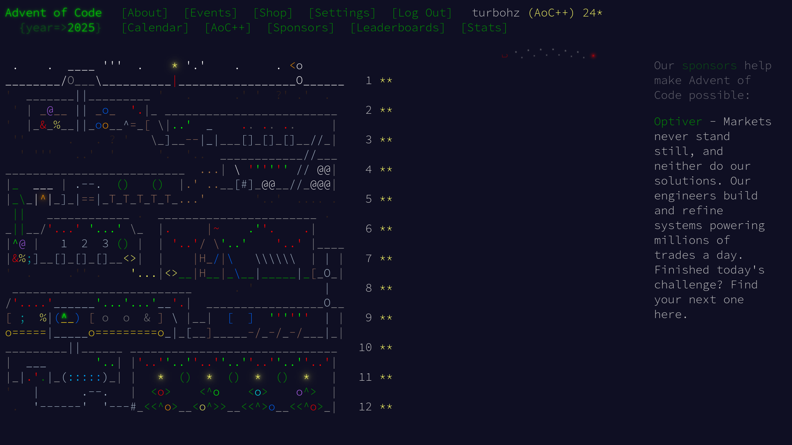

# Advent of Code 2025

Solutions to the **[Advent of Code 2025](https://adventofcode.com/2025)** challenges,
using the Rust programming language.

> This document and the solutions are a work in progress,
> and may often be reviewed and reworked.

## Status

As of Thursday the 28th of 2025, all problems have been solved.



## About these solutions

Instead of atacking the problems with quick and dirty solutions,
the intention is to choose approches that are interesting to me.

## Submission

The solutions submission are performed by test functions gated with the "solve" feature.

```
# All
cargo test --release --features solve
# One
cargo test --release --features solve day\d{2}::submit
```

## Next-test report

Output for `cargo nextest run --release --features solve submit`

```
 Nextest run ID a09f7412-896d-4bc6-9507-375eaf099a4a with nextest profile: default
    Starting 23 tests across 2 binaries (45 tests skipped)
        PASS [   0.390s] aoc_2025 days::day01::submit::test_part1_submit
        PASS [   0.014s] aoc_2025 days::day01::submit::test_part2_submit
        PASS [   0.210s] aoc_2025 days::day02::submit::test_part1_submit
        PASS [   0.635s] aoc_2025 days::day02::submit::test_part2_submit
        PASS [   0.012s] aoc_2025 days::day03::submit::test_part1_submit
        PASS [   0.011s] aoc_2025 days::day03::submit::test_part2_submit
        PASS [   0.028s] aoc_2025 days::day04::submit::test_part1_submit
        PASS [   0.239s] aoc_2025 days::day04::submit::test_part2_submit
        PASS [   0.366s] aoc_2025 days::day05::submit::test_part1_submit
        PASS [   0.008s] aoc_2025 days::day05::submit::test_part2_submit
        PASS [   0.369s] aoc_2025 days::day06::submit::test_part1_submit
        PASS [   0.010s] aoc_2025 days::day06::submit::test_part2_submit
        PASS [   0.358s] aoc_2025 days::day07::submit::test_part1_submit
        PASS [   0.006s] aoc_2025 days::day07::submit::test_part2_submit
        PASS [   0.669s] aoc_2025 days::day08::submit::test_part1_submit
        PASS [   0.787s] aoc_2025 days::day08::submit::test_part2_submit
        PASS [   0.377s] aoc_2025 days::day09::submit::test_part1_submit
        PASS [   0.129s] aoc_2025 days::day09::submit::test_part2_submit
        PASS [   0.341s] aoc_2025 days::day10::submit::test_part1_submit
        PASS [   0.048s] aoc_2025 days::day10::submit::test_part2_submit
        PASS [   0.008s] aoc_2025 days::day11::submit::test_part1_submit
        PASS [   8.464s] aoc_2025 days::day11::submit::test_part2_submit
        PASS [   0.007s] aoc_2025 days::day12::submit::test_part1_submit
────────────
     Summary [   8.863s] 23 tests run: 23 passed, 45 skipped
```
